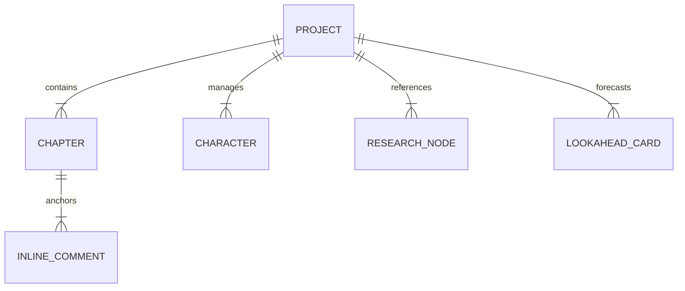
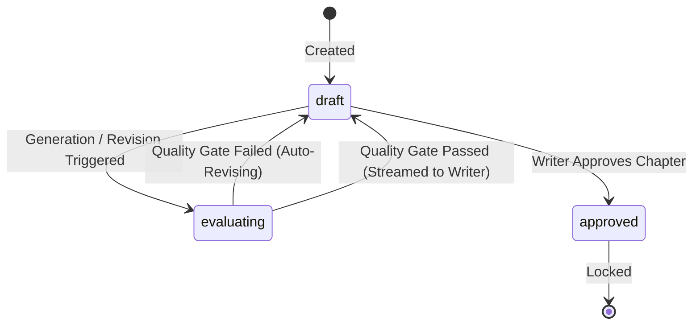
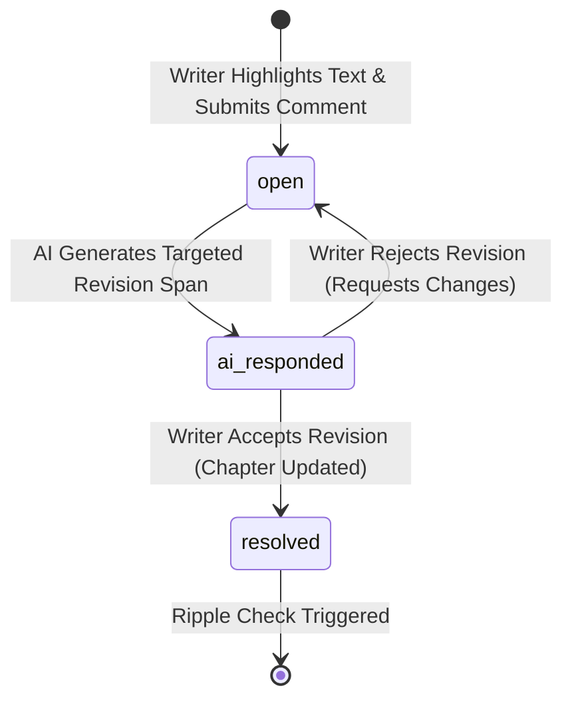

# Phase 1: Data Model & Schema Architecture

**Feature**: vision-gap-plan
**Date**: 2026-05-16

This document defines the core entities, relational schemas, validation constraints, and state transition lifecycles required to support the Six Gaps and Five Additions for Nebula Writer 2.

---

## Entity Overview



---

## 1. Project Entity

The primary container for a novel, encompassing overarching lore, metadata, and structural settings.

### Schema Definition
```sql
CREATE TABLE IF NOT EXISTS projects (
    id TEXT PRIMARY KEY,
    title TEXT NOT NULL DEFAULT 'Untitled Novel',
    author TEXT NOT NULL DEFAULT 'Unknown',
    created_at TIMESTAMP DEFAULT CURRENT_TIMESTAMP,
    updated_at TIMESTAMP DEFAULT CURRENT_TIMESTAMP,
    settings TEXT DEFAULT '{}' -- JSON storing global project preferences
);
```

### Validation Rules
- `id`: Must be a valid, unique UUID string.
- `title`: Cannot be empty; maximum length 255 characters.

---

## 2. Chapter Entity

A sequential narrative unit containing manuscript prose, evaluation metrics, and revision states.

### Schema Definition
```sql
CREATE TABLE IF NOT EXISTS chapters (
    id INTEGER PRIMARY KEY AUTOINCREMENT,
    project_id TEXT NOT NULL REFERENCES projects(id) ON DELETE CASCADE,
    number INTEGER NOT NULL,
    title TEXT NOT NULL,
    content TEXT NOT NULL DEFAULT '',
    quality_score INTEGER DEFAULT 0, -- Composite score (0-100)
    quality_breakdown TEXT DEFAULT '{}', -- JSON storing 8-criteria scores
    status TEXT NOT NULL DEFAULT 'draft', -- 'draft' | 'evaluating' | 'approved'
    created_at TIMESTAMP DEFAULT CURRENT_TIMESTAMP,
    updated_at TIMESTAMP DEFAULT CURRENT_TIMESTAMP,
    UNIQUE(project_id, number)
);
```

### State Transitions


---

## 3. Character Entity

A distinct story actor featuring dynamic lore attributes tracked across the narrative arc.

### Schema Definition
```sql
CREATE TABLE IF NOT EXISTS characters (
    id INTEGER PRIMARY KEY AUTOINCREMENT,
    project_id TEXT NOT NULL REFERENCES projects(id) ON DELETE CASCADE,
    name TEXT NOT NULL,
    role TEXT NOT NULL DEFAULT 'major', -- 'protagonist' | 'major' | 'minor'
    core_desire TEXT NOT NULL DEFAULT '',
    arc_current_state TEXT NOT NULL DEFAULT '',
    relationships TEXT DEFAULT '{}', -- JSON mapping relationships to other character IDs
    created_at TIMESTAMP DEFAULT CURRENT_TIMESTAMP,
    updated_at TIMESTAMP DEFAULT CURRENT_TIMESTAMP
);
```

### Validation Rules
- `name`: Cannot be empty.
- `core_desire`: Editable inline within Studio Mode; updates trigger immediate background propagation checks.

---

## 4. Research Node Entity (Addition 13)

A curated factual reference entry containing verified source citations and confidence ratings.

### Schema Definition
```sql
CREATE TABLE IF NOT EXISTS research_nodes (
    id INTEGER PRIMARY KEY AUTOINCREMENT,
    project_id TEXT NOT NULL REFERENCES projects(id) ON DELETE CASCADE,
    topic TEXT NOT NULL,
    queries_used TEXT NOT NULL DEFAULT '[]', -- JSON array of search strings
    sources TEXT NOT NULL DEFAULT '[]', -- JSON array of source citation dicts
    confidence TEXT NOT NULL DEFAULT 'medium', -- 'high' | 'medium' | 'low'
    verification_status TEXT NOT NULL DEFAULT 'unverified', -- 'unverified' | 'verified' | 'disputed'
    summary TEXT NOT NULL,
    linked_entity_ids TEXT DEFAULT '[]', -- JSON array of related character/chapter IDs
    created_at TIMESTAMP DEFAULT CURRENT_TIMESTAMP,
    last_used_in_chapter INTEGER REFERENCES chapters(id) ON DELETE SET NULL
);
```

### Validation Rules
- `confidence`: Scored as `high` (2+ trusted domains agreeing), `medium` (1 trusted domain OR 3+ general sources), or `low` (1-2 untrusted sources).
- `sources`: Each source dict must contain `title`, `snippet`, `domain`, `url`, and `is_trusted` boolean.

---

## 5. Lookahead Card Entity (Addition 14)

A structured forecasting proposal outlining potential future scene intentions and plot advancements.

### Schema Definition
```sql
CREATE TABLE IF NOT EXISTS lookahead_cards (
    id INTEGER PRIMARY KEY AUTOINCREMENT,
    project_id TEXT NOT NULL REFERENCES projects(id) ON DELETE CASCADE,
    card_index INTEGER NOT NULL, -- 0 = next chapter, 1 = +1 chapter, 2 = +2 chapters
    certainty TEXT NOT NULL DEFAULT 'medium', -- 'high' | 'medium' | 'low'
    chapter_number INTEGER NOT NULL,
    title TEXT NOT NULL,
    scene_intention TEXT NOT NULL,
    opening_image TEXT NOT NULL,
    character_focus TEXT NOT NULL,
    story_questions_open TEXT NOT NULL DEFAULT '[]', -- JSON array
    story_questions_close TEXT NOT NULL DEFAULT '[]', -- JSON array
    tension_targeted TEXT NOT NULL,
    seeds_to_advance TEXT NOT NULL DEFAULT '[]', -- JSON array
    is_approved BOOLEAN NOT NULL DEFAULT 0,
    created_at TIMESTAMP DEFAULT CURRENT_TIMESTAMP,
    UNIQUE(project_id, card_index)
);
```

### Validation Rules
- `card_index`: Strictly constrained to values 0, 1, or 2 representing the 3-card forecasting horizon.

---

## 6. Inline Comment Entity (Gap 5)

A targeted revision note anchored to a specific character-offset span within a chapter.

### Schema Definition
```sql
CREATE TABLE IF NOT EXISTS comments (
    id INTEGER PRIMARY KEY AUTOINCREMENT,
    chapter_id INTEGER NOT NULL REFERENCES chapters(id) ON DELETE CASCADE,
    anchor_start INTEGER NOT NULL, -- Character offset index in chapter content
    anchor_end INTEGER NOT NULL, -- Character offset index in chapter content
    anchor_text TEXT NOT NULL, -- The highlighted text string (used for validation)
    comment_text TEXT NOT NULL,
    ai_response TEXT DEFAULT '', -- AI's revision explanation
    revised_text TEXT DEFAULT '', -- The targeted replacement string
    status TEXT NOT NULL DEFAULT 'open', -- 'open' | 'ai_responded' | 'resolved'
    created_at TIMESTAMP DEFAULT CURRENT_TIMESTAMP,
    updated_at TIMESTAMP DEFAULT CURRENT_TIMESTAMP
);
```

### Validation Rules
- `anchor_start`, `anchor_end`: Must satisfy `0 <= anchor_start < anchor_end <= length(chapter_content)`.
- `anchor_text`: Must exactly match the substring `chapter_content[anchor_start:anchor_end]` at creation time.

### State Transitions

